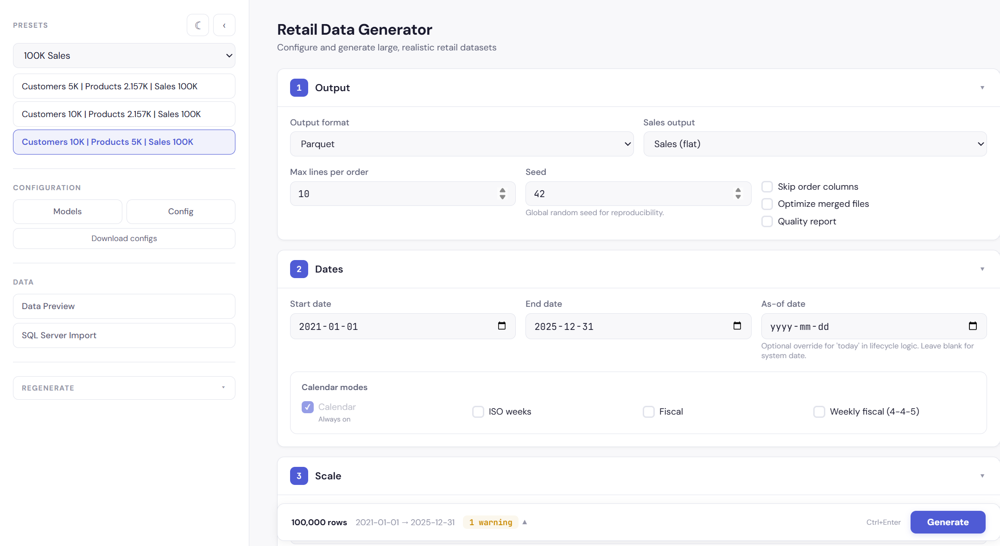
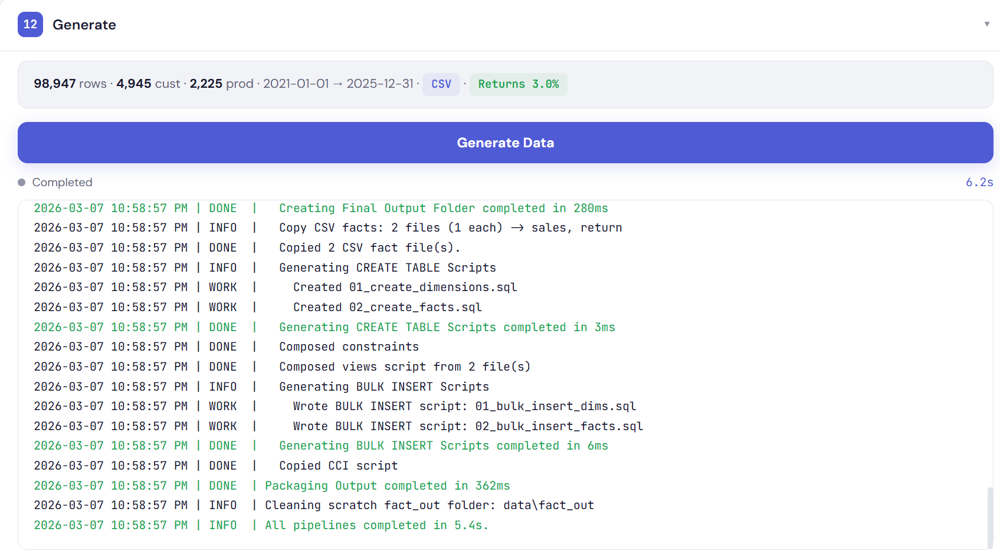
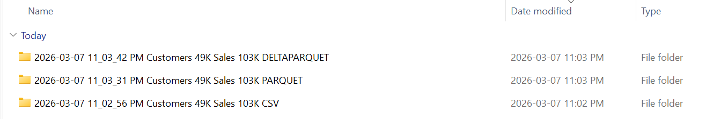
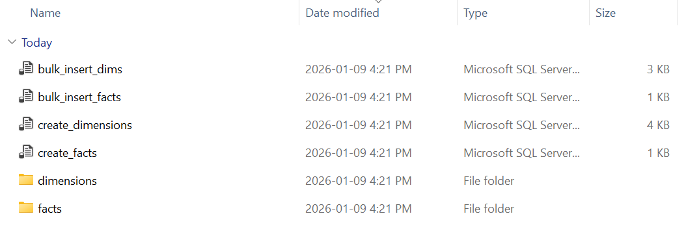
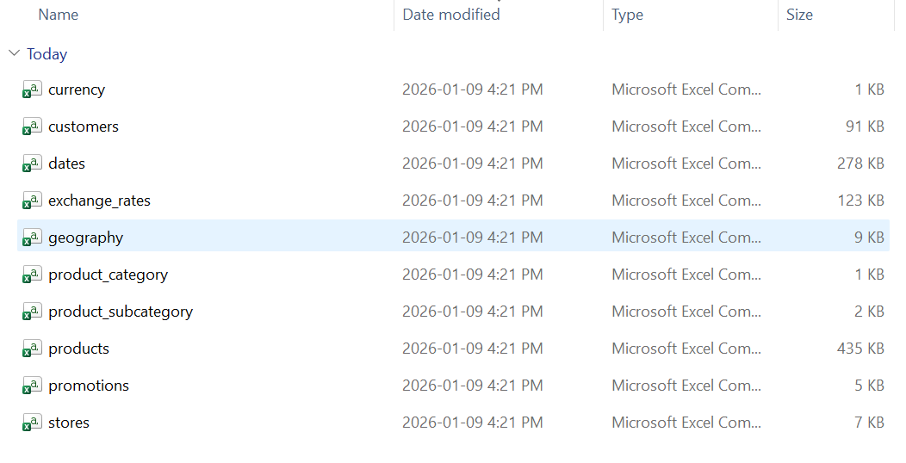
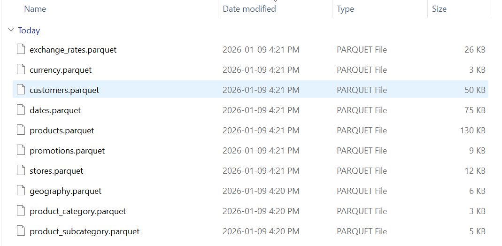
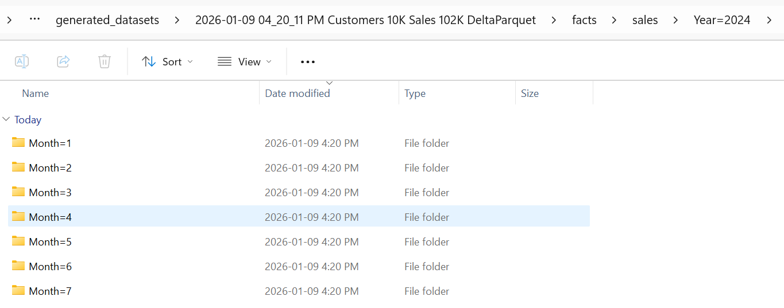
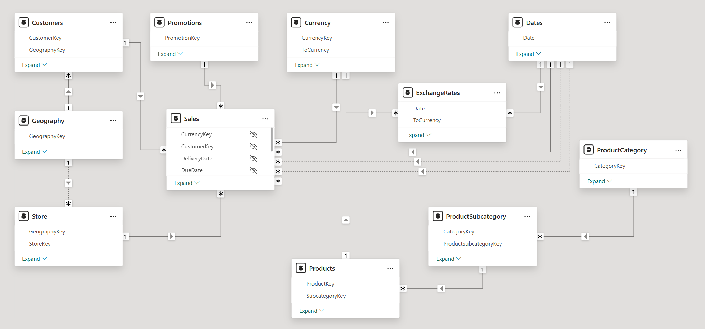
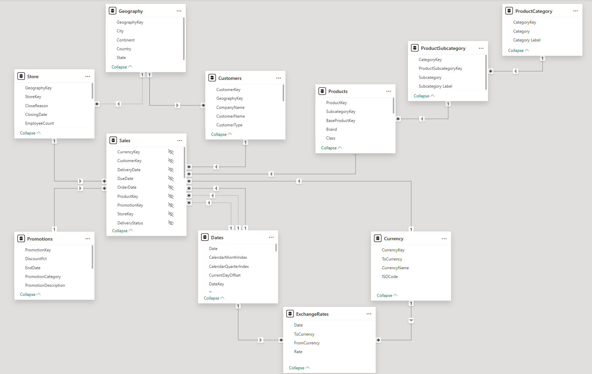

# Synthetic Data Generator (Contoso-based)

Generate a complete, **analytics-ready retail dataset** inspired by **ContosoRetailDW**, with scalable dimensions and realistic sales behavior suitable for BI, analytics, and data modeling scenarios.

The generator is designed to be **deterministic**, **schema-stable**, and **idempotent**, making it ideal for repeatable demos, training, and benchmarking.

## Prerequisites

Required:
- **Python 3.10 or later**
- Git

Optional:
- Power BI Desktop (for analysis and modeling)

Verify your Python version:

```bash
python --version
```

## Getting Started

### Clone the repository

```bash
git clone https://github.com/SharmaAntriksh/synthetic-data-generator.git
cd synthetic-data-generator
```

### Setup Python environment (Windows)

Create the virtual environment and install dependencies:

```powershell
.\scripts\create_venv.ps1
```

Update dependencies (if required):

```powershell
.\scripts\sync_venv.ps1
```

Activate the virtual environment:

```powershell
. .\scripts\activate_venv.ps1
```
## Generate Data

### Run using PowerShell (recommended)

Edit parameters in `scripts\run_generator.ps1`, then run:

```powershell
.\scripts\run_generator.ps1
```

### Run directly via CLI

```powershell
python main.py `
  --format csv `
  --skip-order-cols false `
  --sales-rows 4351 `
  --customers 800 `
  --stores 300 `
  --products 500 `
  --promotions 150 `
  --start-date 2023-06-01 `
  --end-date 2024-12-31 `
  --workers 6 `
  --chunk-size 2000000 `
  --clean
```

## Import data into SQL Server (CSV mode)

Run the commands below **from the project root** with `scripts\run_sql_server_import.ps1`.

> ℹ️ If the target database already exists, the import is skipped automatically.

### ▶️ Windows Authentication (Trusted Connection)

```powershell
.\scripts\run_sql_server_import.ps1 `
  -RunPath ".\generated_datasets\2026-02-06 12_50_26 PM Customers 38K Sales 2M CSV" `
  -Server "SUMMER\SQL2022" `
  -Database Sales_10M `
  -TrustedConnection `
  -ApplyCCI $false
```

### ▶️ SQL Authentication (Username / Password)

```powershell
.\scripts\run_sql_server_import.ps1 `
  -RunPath ".\generated_datasets\2026-01-11 08_10_25 PM Customers 12K Sales 10K CSV" `
  -Server "SUMMER\SQL2022" `
  -Database SyntheticSales `
  -User sa `
  -Password "MyStrongPassword123"
```

> **Notes**
> - SQL authentication requires **Mixed Mode** to be enabled on SQL Server.
> - The run folder must contain the generated SQL scripts  
>   (`create_dimensions.sql`, `bulk_insert_facts.sql`, etc.).

## Web Interface

You can also generate data using the web UI:

```powershell
.\scripts\run_ui.ps1
```

### Generator Web UI



### Pipeline Run Status



---

## Outputs

### Output folder structure


<details>
  <summary><strong>CSV output</strong></summary>

  
  
</details>

<details>
  <summary><strong>Parquet output</strong></summary>

  
</details>

<details>
  <summary><strong>DeltaParquet output</strong></summary>

  
</details>

---

## Power BI Data Model

<details>
  <summary><strong>Collapsed view</strong></summary>

  
</details>

<details>
  <summary><strong>Expanded view</strong></summary>

  
</details>

---

## Releases

See [CHANGELOG.md](CHANGELOG.md) for details on each release.