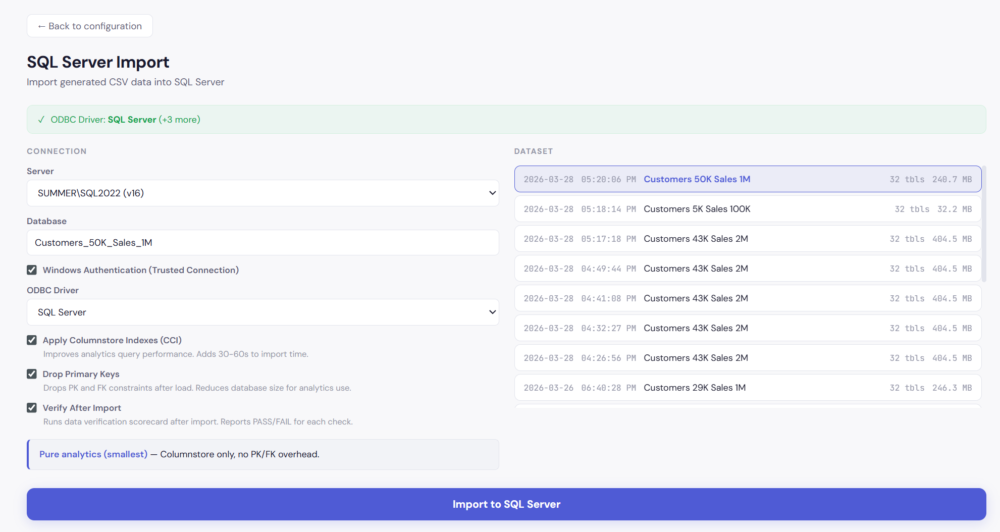

# Contoso Sales Data Generator

Generate a complete, **analytics-ready retail dataset** inspired by the **ContosoRetailDW** schema — with configurable dimensions, realistic sales behavior, budget forecasts, inventory snapshots, wishlists, and complaints. Designed for BI, analytics, data engineering, and data modeling scenarios.

Every run is **deterministic**, **schema-stable**, and **idempotent**, making the generator ideal for repeatable demos, training environments, and benchmarking.

---

## What Gets Generated

The generator produces a full star-schema data model across dimension and fact tables.

**Dimension tables:** Customers, CustomerProfile, OrganizationProfile, Products, ProductProfile, ProductCategory, ProductSubcategory, Stores, Employees, EmployeeStoreAssignments, Dates (calendar + fiscal + weekly fiscal), Time, Geography, Currency, ExchangeRates, Promotions, Suppliers, Plans, CustomerSubscriptions, LoyaltyTiers, SalesChannels, CustomerAcquisitionChannels, ReturnReason

**Fact tables:** Sales (flat or split into SalesOrderHeader + SalesOrderDetail), SalesReturn, BudgetYearly, BudgetMonthly, InventorySnapshot, CustomerWishlists, Complaints

### Output formats

| Format | Description |
|---|---|
| `csv` | CSV files + auto-generated SQL Server bootstrap scripts (CREATE TABLE, BULK INSERT, views, constraints) |
| `parquet` | Merged Apache Parquet with configurable compression, row groups, and dictionary encoding |
| `deltaparquet` | Delta Lake tables partitioned by Year/Month |

Each run produces a self-contained output folder under `generated_datasets/` with all tables, SQL scripts (for CSV), and a Power BI Project template ready to open.

---

## Prerequisites

- **Python 3.11+**
- Git

Optional:
- [uv](https://docs.astral.sh/uv/) — recommended for fast, locked dependency installs (`pip install uv`)
- Power BI Desktop (to explore the included `.pbip` project template)

Verify Python:

```bash
python --version
```

---

## Getting Started

### 1. Clone and set up

```bash
git clone https://github.com/SharmaAntriksh/synthetic-data-generator.git
cd synthetic-data-generator
```

**Windows (PowerShell):**

```powershell
# Create virtual environment and install dependencies
# Uses uv (preferred) if available, falls back to pip
.\scripts\create_venv.ps1

# Activate
. .\scripts\activate_venv.ps1
```

To update dependencies later:

```powershell
.\scripts\sync_venv.ps1
```

**macOS / Linux:**

```bash
# Recommended (locked, reproducible)
pip install uv
uv sync

# Or traditional
python -m venv .venv
source .venv/bin/activate
pip install -r requirements.txt
```

### 2. Generate data

The fastest way to get started — run with default settings from `config.yaml`:

```powershell
.\scripts\run_generator.ps1
```

Or run directly via CLI with overrides:

```bash
python main.py \
  --format parquet \
  --sales-rows 100000 \
  --customers 5000 \
  --stores 50 \
  --products 500 \
  --start-date 2022-01-01 \
  --end-date 2025-12-31 \
  --workers 8 \
  --clean
```

### 3. Explore the output

Generated datasets land in `generated_datasets/` with a timestamped folder name like:

```
generated_datasets/
  └── 2026-03-07 02_30_45 PM Customers 5K Sales 100K Parquet/
      ├── Sales PBIP/
      │   └── Sales.pbip    ← open directly in Power BI
      ├── config/
      │   ├── config.yaml
      │   └── models.yaml
      ├── dimensions/
      │   ├── currency.csv
      │   ├── customer_acquisition_channels.csv
      │   ├── customer_profile.csv
      │   ├── customer_subscriptions.csv       ← if subscriptions enabled
      │   ├── customers.csv
      │   ├── dates.csv
      │   ├── employee_store_assignments.csv
      │   ├── employees.csv
      │   ├── exchange_rates.csv
      │   ├── geography.csv
      │   ├── loyalty_tiers.csv
      │   ├── organization_profile.csv
      │   ├── plans.csv                        ← if subscriptions enabled
      │   ├── product_category.csv
      │   ├── product_profile.csv
      │   ├── product_subcategory.csv
      │   ├── products.csv
      │   ├── promotions.csv
      │   ├── return_reason.csv
      │   ├── sales_channels.csv
      │   ├── stores.csv
      │   ├── suppliers.csv
      │   └── time.csv
      ├── facts/
      │   ├── budget/                          ← if budget enabled
      │   │   ├── budget_monthly.csv
      │   │   └── budget_yearly.csv
      │   ├── complaints/                      ← if complaints enabled
      │   │   └── complaints.csv
      │   ├── customer_wishlists/              ← if wishlists enabled
      │   │   └── customer_wishlists.csv
      │   ├── inventory/                       ← if inventory enabled
      │   │   └── inventory_snapshot.csv
      │   ├── sales/
      │   │   └── sales_chunk0000.csv
      │   └── sales_return/                    ← if returns enabled
      │       └── sales_return_chunk0000.csv
      └── sql/
          ├── indexes/
          │   └── create_drop_cci.sql
          ├── load/
          │   ├── 01_bulk_insert_dims.sql
          │   └── 02_bulk_insert_facts.sql
          └── schema/
              ├── 01_create_dimensions.sql
              ├── 02_create_facts.sql
              ├── 03_create_constraints.sql
              └── 04_create_views.sql
```

---

## Configuration

The generator is driven by two YAML files at the project root.

### `config.yaml` — what to generate

Controls the shape and scale of the dataset: row counts, date ranges, customer profiles, store settings, output format, and feature toggles. Key sections:

| Section | What it controls |
|---|---|
| `scale` | Row/entity counts — sales rows, products (with catalog selection: `contoso` / `synthetic` / `all`), customers, stores, promotions |
| `defaults` | Global seed and date range (`start` / `end`) |
| `sales` | Output format, merge settings, chunk/worker parallelism, compression |
| `returns` | Return rate, timing window, enable/disable |
| `customers` | Region mix (US/EU/India/Asia), org percentage, SCD2 versioning, first-year override |
| `products` | Active ratio, price range, margin range, brand normalization, SCD2 price history. Catalog source (`contoso`/`synthetic`/`all`) is set via `scale.products.catalog` |
| `stores` | Districts, regions, opening/closing dates, product assortment filtering |
| `subscriptions` | Plans + CustomerSubscriptions bridge for DAX many-to-many patterns |
| `employees` | Staff-per-store range, HR fields, store assignment rules with role profiles |
| `dates` | Fiscal start month, calendar/ISO/fiscal/weekly-fiscal toggles |
| `exchange_rates` | Currency list, base currency, volatility |
| `budget` | Scenarios (Low/Medium/High), growth caps, weighting |
| `inventory` | Snapshot grain, reorder compliance, shrinkage, ABC classification |
| `wishlists` | Wishlist generation rate, priority distribution, seasonal patterns |
| `complaints` | Complaint rate, severity distribution, resolution types |

### `models.yaml` — how sales behave

Controls the realism of generated sales data and the overall business shape:

| Section | What it controls |
|---|---|
| `macro_demand` | **Trend preset** — the single knob that defines the business story (see below) |
| `quantity` | Basket size distribution (Poisson lambda, monthly seasonality, noise) |
| `pricing` | Inflation drift, markdown ladder, price snapping/rounding rules |
| `brand_popularity` | Rotating "winner" brand boost each year |
| `returns` | Return reason weights, lag day distribution, partial vs. full-line returns |

### Trend presets

The `macro_demand.trend` setting in `models.yaml` is the single source of business shape. Each preset defines a coherent story across revenue, customer acquisition, churn, and demand behavior.

| Preset | Revenue Shape | Customer Curve |
|---|---|---|
| `steady-growth` | Gentle 5%/yr upward line | Stable base, gradual acquisition |
| `strong-growth` | Exponential acceleration | Continuously growing |
| `gradual-growth` | S-curve with organic dips | Ramp then level off |
| `hockey-stick` | Explosive years 4-6 | Rapid ramp |
| `decline` | Steady year-over-year erosion | Shrinking (high churn) |
| `new-market-entry` | Near-zero then accelerating | Slow start, late ramp |
| `boom-and-bust` | Rapid rise then collapse | Rise then crash |
| `recession-recovery` | U-shape dip and partial recovery | Stable |
| `seasonal-dominant` | Flat trend, strong seasonal swings | Flat with seasonal waves |
| `seasonal-with-growth` | Growth + retail seasonality | Growing with seasonal waves |
| `plateau` | Growth for 4 years then flat | Growth then stable |
| `volatile` | Wild year-to-year swings | Flat with noise |
| `stagnation` | Perfectly flat | Perfectly flat |
| `slow-decline` | Gentle ~10%/yr drop | Gradual erosion |
| `double-dip` | Two distinct downturns | Gradual decline |

### Scaling tips

Chart quality depends on the balance between customers, sales rows, and date range:

- **More customers relative to rows** → spikier, more realistic charts (each customer averages fewer orders, so monthly variation is visible)
- **Fewer customers relative to rows** → smoother, flatter charts (law of large numbers averages out variance)
- **Longer date ranges** → need fewer customers for the same row count (rows spread over more months)
- **Rule of thumb:** target ~1.5 orders per customer per month → `customers ≈ sales_rows / months / 1.5`

**Recommended customer counts** (for visually interesting charts at ~1.5 orders/customer/month):

| Sales Rows | 5 years (60 mo) | 10 years (120 mo) | 20 years (240 mo) |
|---|---|---|---|
| 2M | 22K customers | 11K customers | 6K customers |
| 20M | 222K customers | 111K customers | 56K customers |
| 100M | 1.1M customers | 555K customers | 278K customers |

---

## CLI Reference

All CLI flags override their corresponding `config.yaml` values for the current run only.

```
python main.py [OPTIONS]
```

| Flag | Description |
|---|---|
| `--version` | Print version and exit |
| `--format` | Output format: `csv`, `parquet`, `delta`, `deltaparquet` |
| `--sales-rows N` | Number of sales rows to generate |
| `--customers N` | Number of customers |
| `--stores N` | Number of stores |
| `--products N` | Number of products |
| `--promotions N` | Total promotions (distributed across types) |
| `--start-date YYYY-MM-DD` | Override global start date |
| `--end-date YYYY-MM-DD` | Override global end date |
| `--workers N` | Parallel worker count (default: auto-detect) |
| `--chunk-size N` | Rows per processing chunk |
| `--row-group-size N` | Parquet row group size |
| `--skip-order-cols` | Omit SalesOrderNumber/LineNumber columns |
| `--only dimensions\|sales` | Run only one pipeline stage |
| `--regen-dimensions [names]` | Force regeneration of specific dimensions (e.g., `customers products` or `all`) |
| `--clean` | Delete output folders before running |
| `--dry-run` | Print resolved config and exit without generating |
| `--config PATH` | Path to config file (default: `config.yaml`) |
| `--models-config PATH` | Path to models config file (default: `models.yaml`) |

---

## Parquet Optimization

Re-compress and re-partition existing parquet output without regenerating data. Useful for tuning file size, compression codec, or row group size after a run.

```powershell
python scripts/optimize_parquet.py `
  ".\generated_datasets\2026-03-28 01_03_23 PM Customers 89K Sales 21M PARQUET" `
  -c snappy `
  -r 1_000_000
```

| Flag | Description |
|---|---|
| `-c` / `--compression` | Codec: `snappy`, `zstd`, `gzip`, `brotli`, `lz4`, `none` (default: `zstd`) |
| `-l` / `--level` | Compression level (codec-dependent, e.g. zstd 1-22) |
| `-r` / `--row-group-size` | Target rows per row group (default: 1,000,000) |
| `--in-place` | Overwrite originals instead of writing to a new folder |
| `--dry-run` | Show what would be done without writing |

---

## Delta Lake Optimization

Compact small Delta Lake files into fewer, larger ones. Useful after `deltaparquet` runs where partitioned tables (Sales, InventorySnapshot) produce many small files from parallel chunk writes.

```powershell
python scripts/optimize_delta.py `
  "generated_datasets\2026-03-29 07_11_29 PM Customers 43K Sales 1M DELTAPARQUET" `
  --target-size 256 `
  --min-files 5
```

Tables with 5 or fewer files are skipped automatically (dimensions, small facts). The script runs `OPTIMIZE` (compaction) and `VACUUM` (cleanup) on each qualifying Delta table.

| Flag | Description |
|---|---|
| `--min-files N` | Skip tables with N or fewer files (default: 5) |
| `--target-size MB` | Target file size after compaction in MB (default: 256) |
| `--max-tasks N` | Max concurrent compaction tasks (default: CPU count) |

**Partition tuning:** Inventory partitioning is controlled by `inventory.partition_by` in `config.yaml`. Default is `["Year"]`. Set to `["Year", "Month"]` for finer query pruning at the cost of more files, or `null` to disable partitioning entirely.

---

## SQL Server Import (CSV mode)

When generating in CSV mode, the output includes auto-generated SQL scripts for bootstrapping a SQL Server database. Use the import script to load everything in one step.

> If the target database already exists, the import is skipped automatically.

**Windows Authentication:**

```powershell
.\scripts\run_sql_server_import.ps1 `
  -RunPath ".\generated_datasets\2026-03-26 06_40_28 PM Customers 29K Sales 1M CSV" `
  -Server "YOURSERVER\SQL2022" `
  -Database Sales1M `
  -TrustedConnection `
  -ApplyCCI $true `
  -DropPK $true `
  -Verify
```

**SQL Authentication:**

```powershell
.\scripts\run_sql_server_import.ps1 `
  -RunPath ".\generated_datasets\<your-run-folder>" `
  -Server "YOURSERVER\SQL2022" `
  -Database ContosoSales `
  -User sa `
  -Password "YourPassword"
```

> SQL authentication requires Mixed Mode to be enabled on SQL Server.

| Flag | Description |
|---|---|
| `-TrustedConnection` | Windows Authentication |
| `-User`&nbsp;/&nbsp;`-Password` | SQL Authentication |
| `-ApplyCCI $true` | Create clustered columnstore indexes after load |
| `-DropPK $true` | Drop PKs and FKs before CCI (saved to `[admin].[_PK_Backup]` for restore) |
| `-Verify` | Run post-import data integrity checks |

The import creates all dimension and fact tables, applies PK/FK constraints, and creates analytical views. Dropped constraints can be restored with `EXEC [admin].[ManagePrimaryKeys] @Action = 'RESTORE'`.

### Post-Import Stored Procedures

The import generates stored procedures in the `admin` and `verify` schemas for ongoing management and data validation:

**Admin procedures:**

| Procedure | Description |
|---|---|
| `admin.ManageColumnstoreIndexes` | Create, drop, or rebuild clustered columnstore indexes on fact tables |
| `admin.ManagePrimaryKeys` | Backup, drop, restore, or recreate PK/FK constraints (enables CCI swap) |

**Verification procedures** (run individually or all at once with `verify.RunAll`):

| Procedure | Description |
|---|---|
| `verify.RunAll` | Execute all verification checks and return a combined summary |
| `verify.CrossDimension` | FK integrity between dimension tables (geography → stores, etc.) |
| `verify.Customers` | Customer demographics: type distribution, household coverage, SCD2 validity |
| `verify.EmployeeStoreSales` | Employee-store assignment coverage and sales attribution |
| `verify.FactDistributions` | Sales amount, quantity, and discount statistical distributions |
| `verify.Geography` | Geography completeness: all countries, states, and cities populated |
| `verify.Products` | Product pricing sanity: margin ranges, active ratios, SCD2 consistency |
| `verify.SalesRelationships` | FK integrity from sales → all dimension tables |
| `verify.SecondaryFacts` | Budget, inventory, wishlists, and complaints row counts and FK checks |
| `verify.Stores` | Store types, opening/closing dates, online vs physical distribution |
| `verify.TemporalCoverage` | Date range coverage: sales span matches date dimension |
| `verify.Warehouses` | Warehouse-store assignments and geographic coverage |

---

## Web Interface

A web UI (FastAPI + React) is also available for interactive generation:

```powershell
.\scripts\run_web.ps1
```

### Generator Web UI


### Pipeline Run Status


### SQL Server Import



---

## Generated Dataset Folder


---


## Power BI Data Model

Each output includes a Power BI Project (`.pbip`) template with pre-configured folder paths. Open the `.pbip` file directly in Power BI Desktop — no manual path setup required.


---

## Testing

The project includes 1427+ tests covering config validation, pricing pipeline, quantity model, geography, trend presets, version store, state management, determinism guarantees, edge-case guards, web API, packaging, sales logic, schema validation, product dimensions, sales writer, SQL tools, and date dimension edge cases.

```bash
# Run all tests
pytest

# Run a specific file or class
pytest tests/test_geography.py
pytest tests/test_config_loader.py::TestParseDate

# Stop on first failure
pytest -x

# Rerun only previously failed tests
pytest --lf
```

---
## License

This project is licensed under the [MIT License](LICENSE).
