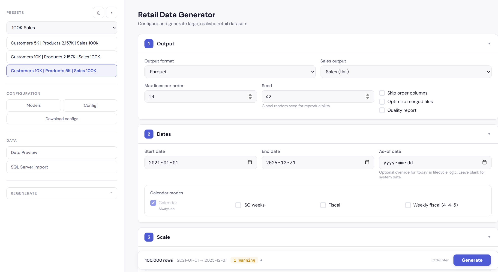
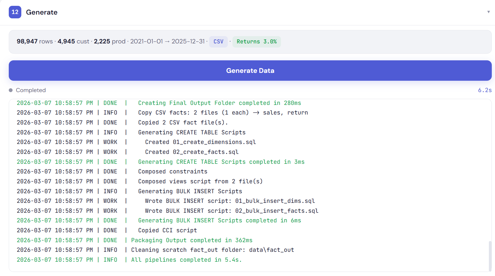
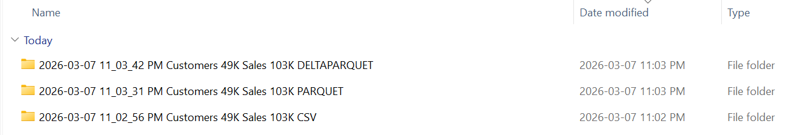
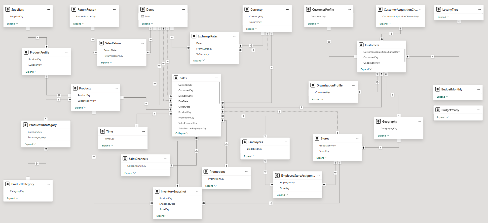

# Contoso Sales Data Generator

Generate a complete, **analytics-ready retail dataset** inspired by the **ContosoRetailDW** schema — with configurable dimensions, realistic sales behavior, budget forecasts, and inventory snapshots. Designed for BI, analytics, data engineering, and data modeling scenarios.

Every run is **deterministic**, **schema-stable**, and **idempotent**, making the generator ideal for repeatable demos, training environments, and benchmarking.

---

## What Gets Generated

The generator produces a full star-schema data model across dimension and fact tables.

**Dimension tables:** Customers, CustomerProfile, OrganizationProfile, Products, ProductProfile, ProductCategory, ProductSubcategory, Stores, Employees, EmployeeStoreAssignments, Dates (calendar + fiscal + weekly fiscal), Time, Geography, Currency, Promotions, Suppliers, LoyaltyTiers, SalesChannels, CustomerAcquisitionChannels, ReturnReason

**Fact tables:** Sales (flat or split into SalesOrderHeader + SalesOrderDetail), SalesReturn, ExchangeRates, BudgetYearly, BudgetMonthly, InventorySnapshot

**Optional dimension tables (disabled by default):** CustomerSegment + CustomerSegmentMembership, Superpowers + CustomerSuperpowers

### Output formats

| Format | Description |
|---|---|
| `csv` | CSV files + auto-generated SQL Server bootstrap scripts (CREATE TABLE, BULK INSERT, views, constraints) |
| `parquet` | Merged Apache Parquet with configurable compression, row groups, and dictionary encoding |
| `deltaparquet` | Delta Lake tables partitioned by Year/Month |

Each run produces a self-contained output folder under `generated_datasets/` with all tables, SQL scripts (for CSV), and a Power BI Project template ready to open.

---

## Prerequisites

- **Python 3.10+**
- Git

Optional:
- Power BI Desktop (to explore the included `.pbip` project template)

Verify Python:

```bash
python --version
```

---

## Getting Started

### 1. Clone and set up

```bash
git clone https://github.com/SharmaAntriksh/synthetic-data-generator.git
cd synthetic-data-generator
```

**Windows (PowerShell):**

```powershell
# Create virtual environment and install dependencies
.\scripts\create_venv.ps1

# Activate
. .\scripts\activate_venv.ps1
```

To update dependencies later:

```powershell
.\scripts\sync_venv.ps1
```

**macOS / Linux:**

```bash
python -m venv .venv
source .venv/bin/activate
pip install -r requirements.txt
```

### 2. Generate data

The fastest way to get started — run with default settings from `config.yaml`:

```powershell
.\scripts\run_generator.ps1
```

Or run directly via CLI with overrides:

```bash
python main.py \
  --format parquet \
  --sales-rows 100000 \
  --customers 5000 \
  --stores 50 \
  --products 500 \
  --start-date 2022-01-01 \
  --end-date 2025-12-31 \
  --workers 8 \
  --clean
```

### 3. Explore the output

Generated datasets land in `generated_datasets/` with a timestamped folder name like:

```
generated_datasets/
  └── 2026-03-07 02_30_45 PM Customers 5K Sales 100K Parquet/
      ├── Sales PBIP/
      │   └── Sales.pbip    ← open directly in Power BI
      ├── config/
      │   ├── config.yaml
      │   └── models.yaml
      ├── dimensions/
      │   ├── currency.csv
      │   ├── customers.csv
      │   ├── dates.csv
      │   ├── employees.csv
      │   ├── exchange_rates.csv
      │   ├── geography.csv
      │   ├── products.csv
      │   ├── promotions.csv
      │   ├── return_reason.csv
      │   ├── stores.csv
      │   └── time.csv
      ├── facts/
      │   ├── budget/
      │   │   ├── budget_monthly.csv
      │   │   └── budget_yearly.csv
      │   ├── inventory/
      │   │   └── inventory_snapshot.csv
      │   ├── sales/
      │   │   └── sales_chunk0000.csv
      │   └── sales_return/
      │       └── sales_return_chunk0000.csv
      └── sql/
          ├── indexes/
          │   └── create_drop_cci.sql
          ├── load/
          │   ├── 01_bulk_insert_dims.sql
          │   └── 02_bulk_insert_facts.sql
          └── schema/
              ├── 01_create_dimensions.sql
              ├── 02_create_facts.sql
              ├── 03_create_constraints.sql
              └── 04_create_views.sql
```

---

## Configuration

The generator is driven by two YAML files at the project root.

### `config.yaml` — what to generate

Controls the shape and scale of the dataset: row counts, date ranges, customer profiles, store settings, output format, and feature toggles. Key sections:

| Section | What it controls |
|---|---|
| `scale` | Row/entity counts — sales rows, products, customers, stores, promotions |
| `defaults` | Global seed and date range (`start` / `end`) |
| `sales` | Output format, merge settings, chunk/worker parallelism, compression |
| `returns` | Return rate, timing window, enable/disable |
| `products` | Active ratio, price range, margin range, brand normalization |
| `customers` | Region mix (US/EU/India), org percentage, acquisition profile |
| `customer_segments` | Segment count, membership rules, churn modeling (disabled by default) |
| `superpowers` | Fun many-to-many dimension for testing bridge tables (disabled by default) |
| `employees` | Staff-per-store range, HR fields, store assignment rules with role profiles |
| `dates` | Fiscal start month, calendar/ISO/fiscal/weekly-fiscal toggles |
| `exchange_rates` | Currency list, base currency, volatility |
| `budget` | Scenarios (Low/Medium/High), growth caps, weighting |
| `inventory` | Snapshot grain, reorder compliance, shrinkage, ABC classification |

### `models.yaml` — how sales behave

Controls the realism of generated sales data at the product level:

| Section | What it controls |
|---|---|
| `macro_demand` | Year-level demand factors (growth trajectory across years) |
| `quantity` | Basket size distribution (Poisson lambda, monthly seasonality, noise) |
| `pricing` | Inflation drift, markdown ladder, price snapping/rounding rules |
| `brand_popularity` | Rotating "winner" brand boost each year |
| `returns` | Return reason weights, lag day distribution, partial vs. full-line returns |

### Customer acquisition profiles

The `customers.profile` setting in `config.yaml` controls how customers are acquired over time:

| Profile | Behavior |
|---|---|
| `steady` | Even acquisition pace across the date range |
| `gradual` | Slow initial ramp, accelerating over time |
| `aggressive` | Heavy front-loading with rapid early growth |
| `instant` | All customers available from day one |

---

## CLI Reference

All CLI flags override their corresponding `config.yaml` values for the current run only.

```
python main.py [OPTIONS]
```

| Flag | Description |
|---|---|
| `--format` | Output format: `csv`, `parquet`, `delta`, `deltaparquet` |
| `--sales-rows N` | Number of sales rows to generate |
| `--customers N` | Number of customers |
| `--stores N` | Number of stores |
| `--products N` | Number of products |
| `--promotions N` | Total promotions (distributed across types) |
| `--start-date YYYY-MM-DD` | Override global start date |
| `--end-date YYYY-MM-DD` | Override global end date |
| `--workers N` | Parallel worker count (default: auto-detect) |
| `--chunk-size N` | Rows per processing chunk |
| `--row-group-size N` | Parquet row group size |
| `--skip-order-cols` | Omit SalesOrderNumber/LineNumber columns |
| `--only dimensions\|sales` | Run only one pipeline stage |
| `--regen-dimensions [names]` | Force regeneration of specific dimensions (e.g., `customers products` or `all`) |
| `--clean` | Delete output folders before running |
| `--dry-run` | Print resolved config and exit without generating |
| `--config PATH` | Path to config file (default: `config.yaml`) |
| `--models-config PATH` | Path to models config file (default: `models.yaml`) |

---

## SQL Server Import (CSV mode)

When generating in CSV mode, the output includes auto-generated SQL scripts for bootstrapping a SQL Server database. Use the import script to load everything in one step.

> If the target database already exists, the import is skipped automatically.

**Windows Authentication:**

```powershell
.\scripts\run_sql_server_import.ps1 `
  -RunPath ".\generated_datasets\2026-03-07 10_18_21 PM Customers 49K Sales 100K CSV>" `
  -Server "YOURSERVER\SQL2022" `
  -Database Sales100K `
  -TrustedConnection
  -ApplyCCI $true
```

**SQL Authentication:**

```powershell
.\scripts\run_sql_server_import.ps1 `
  -RunPath ".\generated_datasets\<your-run-folder>" `
  -Server "YOURSERVER\SQL2022" `
  -Database ContosoSales `
  -User sa `
  -Password "YourPassword"
```

> SQL authentication requires Mixed Mode to be enabled on SQL Server.

The import creates all dimension and fact tables, applies PK/FK constraints, and creates analytical views. Add `-ApplyCCI $true` to also create clustered columnstore indexes.

---

## Web Interface

A Streamlit-based UI is also available for interactive generation:

```powershell
.\scripts\run_web.ps1
```

### Generator Web UI



### Pipeline Run Status



---

## Generated Dataset Folder



---

## Power BI Data Model

Each output includes a Power BI Project (`.pbip`) template with pre-configured folder paths. Open the `.pbip` file directly in Power BI Desktop — no manual path setup required.



---

## Testing

The project includes 186 unit tests covering config validation, pricing pipeline, quantity model, geography, customer profiles, version store, state management, and determinism guarantees.

```bash
# Run all tests
pytest

# Run a specific file or class
pytest tests/test_geography.py
pytest tests/test_config_loader.py::TestParseDate

# Stop on first failure
pytest -x

# Rerun only previously failed tests
pytest --lf
```

---
## License

This project is licensed under the [MIT License](LICENSE).

---
## Releases

See [CHANGELOG.md](CHANGELOG.md) for details on each release.
